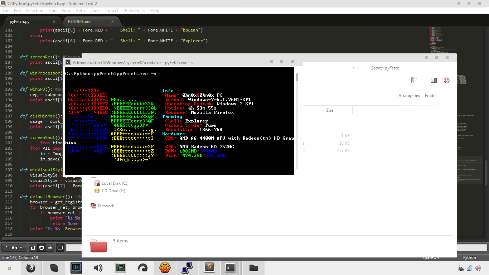

pyFetch 
This is currently windows only and for atleast right now, plans for GNU/Linux. 
 
 
Current Information

Name: userName@hostName 
Kernel: Kernel 
Operating System: OS ServicePack 
Uptime: H M S (Total hours, minutes, and seconds, not H:M:S) 
 
Shell: bbLean or Explorer 
Theme: Visual Style being currently used 
Resolution: Your screen resolution, example: 1366x768 
 
CPU: Your CPU 
GPU: Your GPU 
RAM: FreeRam/MaxRam 
Disk: Free DiskSpace/Max Diskspace (Currently only works with C:/) 
